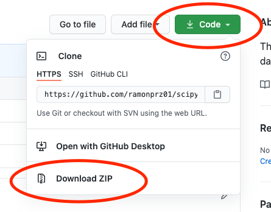

# People Analytics

Welcome to the course, People Analytics. Where you will learn about how to harness the power of prediction to make decisions backed by data about the most important capital asset an organization can have, its employees.

## Navigation

- [Notebooks](https://ramonprz01.github.io/people-analytics/notebooks/)
- [Setup](https://ramonprz01.github.io/people-analytics/setup/)

## Content

1. Background
2. How to do this course
3. [Notebooks](https://ramonprz01.github.io/people-analytics/notebooks/)

## 1. Background

This course was first taught at London Business School from January to March 2021. Main lessons were taught by Professor Isabel Fernandez-Mateo, and Ramon Perez provided the statistical programming sessions contained in the notebooks you are about to use.

## 2. How to do this course
There are two ways in which you can do this course:
1. Without installing anything in your computer and just following the link below. It will take you directly to an isolated environment on the internet where you can go over the lesson on your own in a new tab on your browser.

2. By following the installation steps available in the folder called [setup](https://ramonprz01.github.io/people-analytics/setup/).

## 3. [Notebooks](https://ramonprz01.github.io/people-analytics/notebooks/)

The [notebooks](https://ramonprz01.github.io/people-analytics/notebooks/) folder contains all of the lessons for the course as jupyter notebooks. By clicking on the `View and Download Lesson X` button you will be taken to a static version of such notebook. Once there, you can click on the upper right-hand corner button to download that notebook. In addition, you can click on the 3 circles icon and that will take you to a Binder version of the notebook where you can run the code in that notebook freely.

Here is what you will learn in each of the lessons in this course.

### Lesson 0 - Introduction to Python

If this is your first time using Python, you will benefit from going through this lesson. Not only will you learn some of the basics of Python but you will also go through a few of the key pieces of the data analytics cylce while creating some compelling visualizations.

### Lesson 1 - Regression Analysis

In this lesson, you will learn about regression analysis and, more specifically, what it is and how do we run a regression in Python.

### Lesson 2 - Panel Data Analysis

This lesson covers Panel Data in Python. Panel Data is a blend of Time Series and Cross-Sectional Analysis, this means that it deals with data at different time intervals but with some consistency and following the same sample.

### Lesson 3 - Lasso Regression

Lasso regression is a regression model with a penalty applied to the coefficients of your independent variables, if these coefficients don't contribute much to the model. This is a regularization method where the coefficient that has been penalized by the model gets turned immediately into 0. 

### Lesson 4 - NLP and Topic Modeling

This lesson covers a short introduction to Natural Language Processing and one of the many techniques within it, Topic Modeling.

### Lesson 5 - Network Analysis

In this lesson, you will learn about the different applications of Network Analysis, and, more specifically, you will learn three modeling techniques that will help you spot important personel within an organization.

## Downloading Everything (Including the Data)

Download the repo using the big green button on the upper right of the repository for this course, which can be found [here](https://github.com/ramonprz01/people-analytics). See below.

