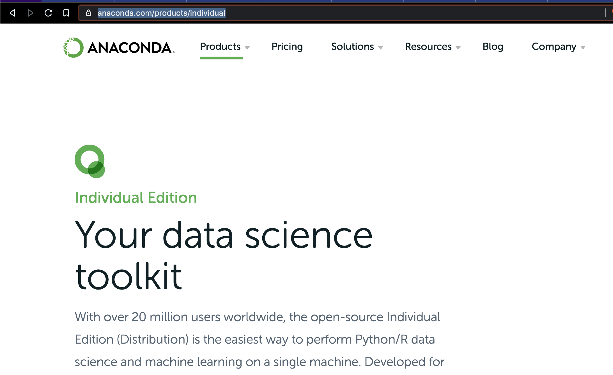

# Anaconda Installation

Anaconda is a for-profit organization that has democratized the use of open-source software for data science. It has packaged some of the most important tools in the data science ecosystem and provided them free of charge in an environment downloable from their website. The most important tools we will be using from Anaconda are:

- Conda: an environment and package manager for python.
- JupyterLab: an integrated development environment where we will write and test our code.

Next, we will download and install Anaconda

1. Navigate to the individual edition page of [Anaconda](https://www.anaconda.com/products/individual). 

2. Scroll all the way down and select the appropriate distribution for your Operating System. 
3. After downloading the installer, open it and follow the instructions while making sure, when prompted, to add Anaconda to path. After installation, you can look for the Anaconda-Navigator to launch JupyterLab. This will immediately open a new tab in your browser.

Once you check that JupyterLab opens fine and that everything is running correctly, you can close the tab and then Anaconda.

Alternatively, you can install Miniconda instead [here][miniconda]. Miniconda is a free minimal installer for conda. It is a small, bootstrap version of Anaconda that includes only conda, Python, the packages they depend on, and a small number of other useful packages such as pip, zlib and others.

For more info on whether to install Anaconda or Miniconda, please read the [comparison FAQ][anaconda-faq].

For this course, we recommend installing Anaconda.

[anaconda-website]: <https://www.anaconda.com/distribution/#download-section>
[miniconda]: <https://docs.conda.io/en/latest/miniconda.html>
[anaconda-faq]: <https://docs.conda.io/projects/conda/en/latest/user-guide/install/download.html#anaconda-or-miniconda>